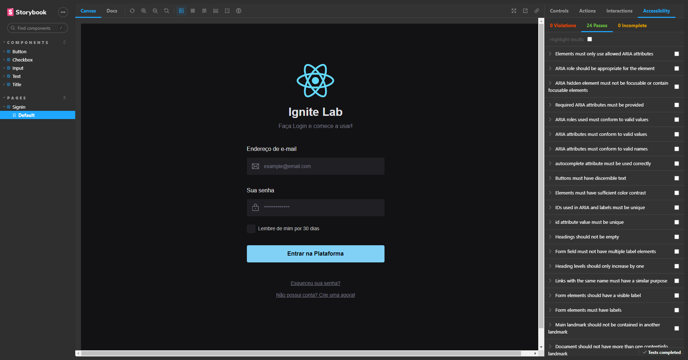
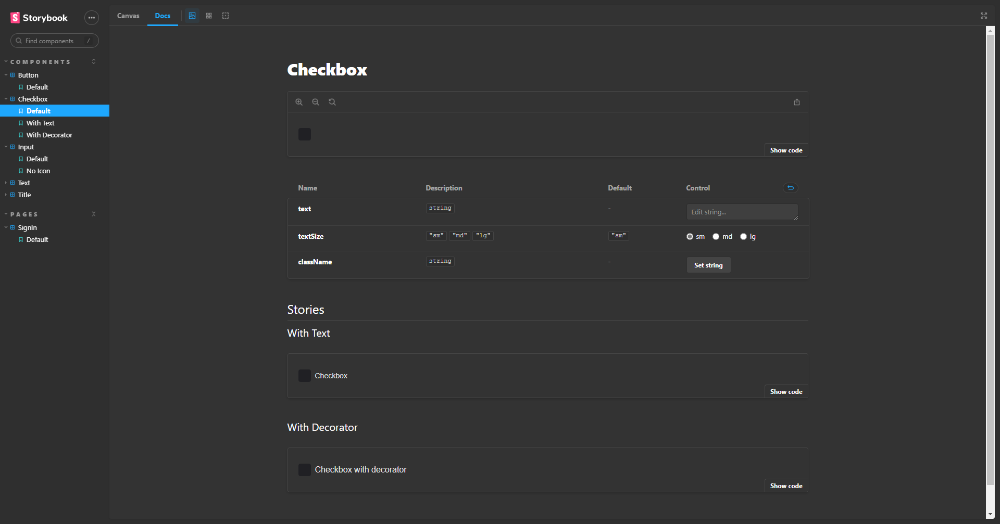
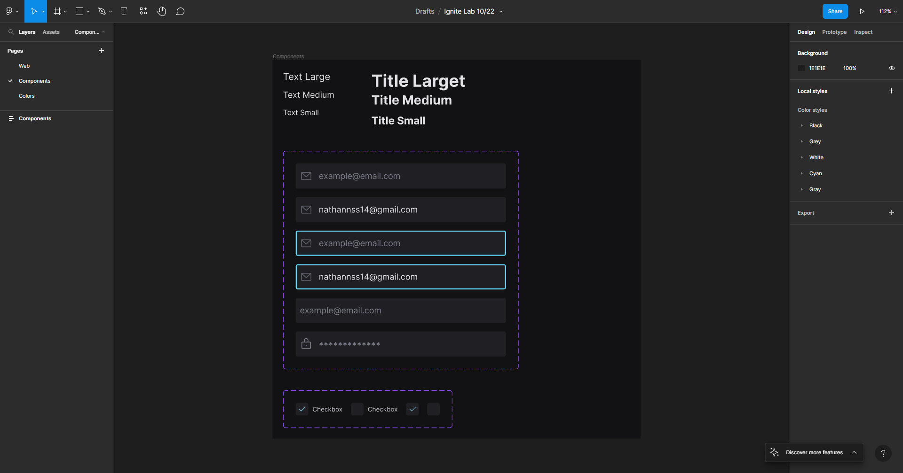
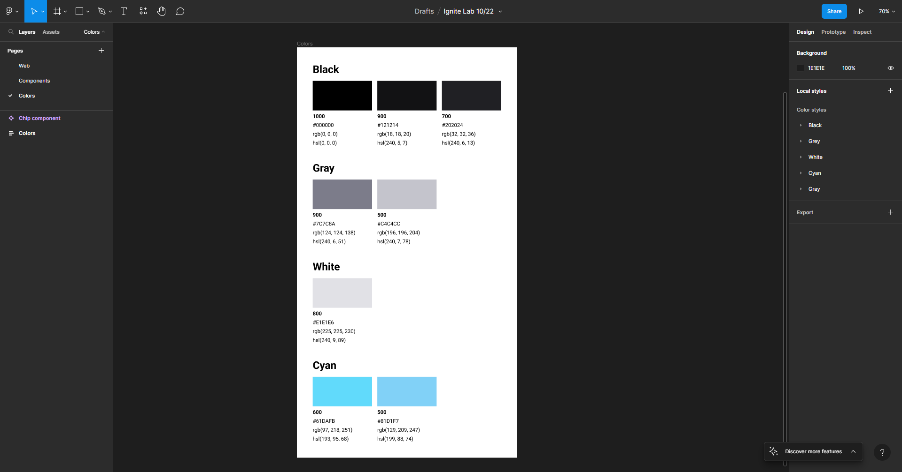

<h1 align="center">Design System (StoryBook + Figma)</h1>

  

<!--  -->
</img>
</img> 
</img>
</img> 

 

## 💻 Projeto

Este Design System foi construído com [Figma](https://www.figma.com) e documentado com [StoryBook](https://storybook.js.org/), desenvolvido durante o evento [ignite Lab 03](https://github.com/rocketseat-education/ignite-lab-design-system) dá Rockeseat, no qual apresentam as principais praticas, padrões e tecnologias utilizadas por eles e o mercado para construir um Design System.

##  🔗 Links
||
| ---|
| </img> <a href="https://www.figma.com/file/mx29SLNzICpdCo3elerLJz/Ignite-Lab-10%2F22?node-id=1%3A2&t=CZFHoNTvCEyd48hf-1" target="_blank">Design System (Figma)</a> |
| <picture><source media="(prefers-color-scheme: dark)" srcset="https://user-images.githubusercontent.com/263385/199832481-bbbf5961-6a26-481d-8224-51258cce9b33.png" width="60px"></picture> <a href="https://NathanNSS.github.io/Design_System/" target="_blank">Documentação StoryBook</a> |

## ✨ Tecnologias

Esse projeto foi desenvolvido com as seguintes tecnologias:
- [React](https://reactjs.org/)
- [Radix](https://www.radix-ui.com/)
- [Figma](https://www.figma.com/)
- [StoryBook](https://storybook.js.org/)
- [Tailwindcss](https://tailwindcss.com/)
- [TypeScript](https://www.typescriptlang.org/)

## 🚀 Como executar
- Clone o repositório
>Web
- Rode `npm install` para instalar as dependências
- Rode o `npm run dev` para iniciar a aplicação na porta <b>3000</b>
- Por fim, o <b>Website</b> estará disponível em `http://localhost:3000`
>Documentação
- Rode `npm run storybook` para iniciar a aplicação na porta <b>6006</b>
- Por fim, a <b>Documentação</b> estará disponível em `http://localhost:6006`

## 📄 Licença

Esse projeto está sob a licença MIT. Veja o arquivo [LICENSE](LICENSE) para mais detalhes.